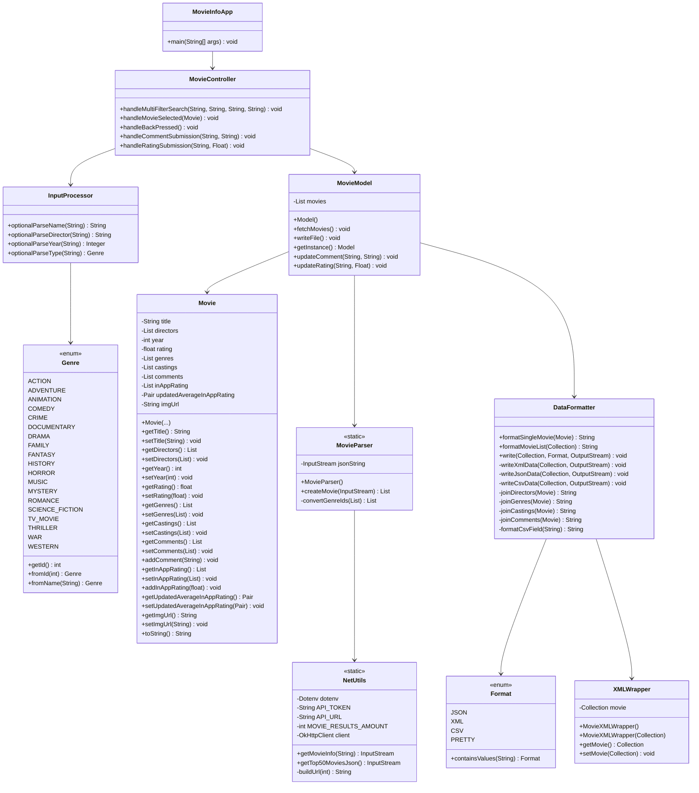

# Design Documents

## Initial Design

```mermaid
classDiagram

class MovieInfoApp {
    +main(String[] args) void
}


class MovieModel {
    -List<Movie> movies
    +Model()
    +fetchMovies() void
    +writeFile() void
    +getInstance() Model
    +updateComment(String, String) void
    +updateRating(String, Float) void
}


class MovieController {
    +handleMultiFilterSearch(String, String, String, String) void
    +handleMovieSelected(Movie) void
    +handleBackPressed() void
    +handleCommentSubmission(String, String) void
    +handleRatingSubmission(String, Float) void
}

class MovieParser {
    <<static>>
    -InputStream jsonString
    +MovieParser()
    +createMovie(InputStream) List<Movie>
    -convertGenreIds(List<Integer>) List<Genre>
}

class NetUtils {
    <<static>>
    +getMovieInfo(String) InputStream
    +getTop50MoviesJson() InputStream
    -buildUrl(int) String
    -Dotenv dotenv
    -String API_TOKEN
    -String API_URL
    -int MOVIE_RESULTS_AMOUNT
    -OkHttpClient client
}

class Movie {
    -String title
    -List<String> directors
    -int year
    -float rating
    -List<Genre> genres
    -List<String> castings
    -List<String> comments
    -List<Float> inAppRating
    -Pair<Float, Integer> updatedAverageInAppRating
    -String imgUrl
    +Movie(...)
    +getTitle() String
    +setTitle(String) void
    +getDirectors() List<String>
    +setDirectors(List<String>) void
    +getYear() int
    +setYear(int) void
    +getRating() float
    +setRating(float) void
    +getGenres() List<Genre>
    +setGenres(List<Genre>) void
    +getCastings() List<String>
    +setCastings(List<String>) void
    +getComments() List<String>
    +setComments(List<String>) void
    +addComment(String) void
    +getInAppRating() List<Float>
    +setInAppRating(List<Float>) void
    +addInAppRating(float) void
    +getUpdatedAverageInAppRating() Pair<Float, Integer>
    +setUpdatedAverageInAppRating(Pair<Float, Integer>) void
    +getImgUrl() String
    +setImgUrl(String) void
    +toString() String
}

class Genre {
    <<enum>>
    ACTION
    ADVENTURE
    ANIMATION
    COMEDY
    CRIME
    DOCUMENTARY
    DRAMA
    FAMILY
    FANTASY
    HISTORY
    HORROR
    MUSIC
    MYSTERY
    ROMANCE
    SCIENCE_FICTION
    TV_MOVIE
    THRILLER
    WAR
    WESTERN
    +getId() int
    +fromId(int) Genre
    +fromName(String) Genre
}


class DataFormatter {
    +formatSingleMovie(Movie) String
    +formatMovieList(Collection<Movie>) String
    +write(Collection<Movie>, Format, OutputStream) void
    -writeXmlData(Collection<Movie>, OutputStream) void
    -writeJsonData(Collection<Movie>, OutputStream) void
    -writeCsvData(Collection<Movie>, OutputStream) void
    -joinDirectors(Movie) String
    -joinGenres(Movie) String
    -joinCastings(Movie) String
    -joinComments(Movie) String
    -formatCsvField(String) String
}

class Format {
    <<enum>>
    JSON
    XML
    CSV
    PRETTY
    +containsValues(String) Format
}

class XMLWrapper {
    -Collection<Movie> movie
    +MovieXMLWrapper()
    +MovieXMLWrapper(Collection<Movie>)
    +getMovie() Collection<Movie>
    +setMovie(Collection<Movie>) void
}

class InputProcessor {
    +optionalParseName(String) String
    +optionalParseDirector(String) String
    +optionalParseYear(String) Integer
    +optionalParseType(String) Genre
}

%% Relationships
MovieInfoApp --> MovieController


MovieController --> InputProcessor
MovieController --> MovieModel

InputProcessor --> Genre

MovieModel --> Movie
MovieModel --> MovieParser
MovieModel --> DataFormatter

MovieParser --> NetUtils

DataFormatter --> Format
DataFormatter --> XMLWrapper
```

## Final Design
We add several helper classes to conform Single Responsibility Principle.

```mermaid

classDiagram
    class MovieFeasterApplication {
        + main(args: String[]) void
        - MovieFeasterApplication()
    }

   class Movie {
        - int movieId
        - String title
        - List~String~ directors
        - int year
        - double rating
        - List~Genre~ genres
        - String overview
        - List~String~ castings
        - List~String~ comments
        - List~Double~ inAppRating
        - String imgUrl

        + getMovieId(): int
        + setMovieId(int): void
        + getTitle(): String
        + setTitle(String): void
        + getDirectors(): List~String~
        + setDirectors(List~String~): void
        + getYear(): int
        + setYear(int): void
        + getRating(): double
        + setRating(double): void
        + getGenres(): List~Genre~
        + setGenres(List~Genre~): void
        + getOverview(): String
        + setOverview(String): void
        + getCastings(): List~String~
        + setCastings(List~String~): void
        + getComments(): List~String~
        + setComments(List~String~): void
        + addComment(String): void
        + getInAppRating(): double
        + setInAppRating(List~Double~): void
        + addInAppRating(Double): void
        + getImgUrl(): String
        + setImgUrl(String): void
        + toString(): String
    }

    class Builder {
        - int movieId
        - String title
        - List~String~ directors
        - int year
        - double rating
        - List~Genre~ genres
        - String overview
        - List~String~ castings
        - String imgUrl

        + movieId(int): Builder
        + title(String): Builder
        + directors(List~String~): Builder
        + year(int): Builder
        + rating(double): Builder
        + genres(List~Genre~): Builder
        + overview(String): Builder
        + castings(List~String~): Builder
        + imgUrl(String): Builder
        + build(): Movie
    }

    class Genre {
        <<enum>>
        -String name
        -int id
        +Genre(String, int)
        +getName() String
        +getId() int
    }

    class Format {
        <<enum>>
        + JSON
        + XML
        + CSV
        + PRETTY
        + containsValues(value: String) Format
    }

    class MovieFilterType {
        <<enum>>
        + TITLE_KEYWORD
        + EXACT_TITLE
        + DIRECTOR
        + ACTOR
        + GENRE
        + YEAR
        + YEAR_RANGE
        + MIN_RATING
        + MAX_RATING
        + COMMENT_KEYWORD
        + MIN_INAPP_RATING
    }

    class MovieSorterType {
        <<enum>>
        - String value
        + TITLE_ASC
        + TITLE_DESC
        + YEAR_ASC
        + YEAR_DESC
        + RATING_ASC
        + RATING_DESC
        + INAPP_RATING_ASC
        + INAPP_RATING_DESC
        + MovieSorterType(String value)
        + getValue() String
        + fromValue(String value) MovieSorterType
    }

    class MovieController {
        - MovieModel model
        - InputProcessor inputProcessor
        + handleMultiFilterSearch(title, director, cast, year, genre) List~Movie~
        + handleSort(sortType) List~Movie~
        + handleCommentSubmission(movieId, comment) String
        + handleRatingSubmission(movieId, rating) void
        + getAllGenres() List~String~
        + getAllMovies() List~Movie~
        + getMovieById(movieId) Movie
        + exportMovies(format) ResponseEntity~byte[]~
    }

    class MovieControllerInterface {
        <<interface>>
        +processUserInput(String) String
        +getMovieById(int) Movie
        +getMoviesByTitle(String) List~Movie~
        +getMoviesByGenre(Genre) List~Movie~
        +getMoviesByYear(int) List~Movie~
        +getMoviesByRating(double) List~Movie~
        +addComment(int, String)
        +addRating(int, double)
    }

    class InputProcessor {
        - InputProcessor()
        + String optionalParseTitle(String)
        + String optionalParseDirector(String)
        + String optionalParseCast(String)
        + Integer optionalParseYear(String)
        + Genre optionalParseGenre(String)
    }

    class InputProcessorInterface {
        <<interface>>
        + String optionalParseTitle(String)
        + String optionalParseDirector(String)
        + String optionalParseCast(String)
        + Integer optionalParseYear(String)
        + Genre optionalParseGenre(String)
    }

    class MovieModel {
        - List~Movie~ movies
        - List~Movie~ processedMovies
        - MovieSorterType defaultSortType
        + MovieModel()
        + fetchMovies() void
        + getMovies() List~Movie~
        + getMovieById(movieId: int) Movie
        + getProcessedMovies() List~Movie~
        + writeFile(useProcessedMovie: boolean, format: Format) void
        + searchByFilter(filtersStrategy: Map~MovieFilterType, Object~) void
        + sortMovieList(sortType: MovieSorterType) void
        + setDefaultSortType(defaultSortType: MovieSorterType) void
        + updateComments(movieId: int, comment: String) void
        + updateRating(movieId: int, rating: double) void
    }

    class MovieModelInterface {
        <<interface>>
        + fetchMovies() void
        + writeFile(useProcessedMovie: boolean, format: Format) void
        + searchByFilter(filtersStrategy: Map~MovieFilterType, Object~) void
        + updateComments(movieID: int, comment: String) void
        + updateRating(movieID: int, rating: double) void
    }

    class MovieFilter {
        <<static>>
        + filterByTitle(movies: List~Movie~, title: String) List~Movie~
        + filterByExactTitle(movies: List~Movie~, title: String) List~Movie~
        + filterByDirector(movies: List~Movie~, director: String) List~Movie~
        + filterByActor(movies: List~Movie~, actor: String) List~Movie~
        + filterByGenre(movies: List~Movie~, genre: String) List~Movie~
        + filterByYear(movies: List~Movie~, year: int) List~Movie~
        + filterByYearRange(movies: List~Movie~, startYear: int, endYear: int) List~Movie~
        + filterByMinRating(movies: List~Movie~, rating: double) List~Movie~
        + filterByMaxRating(movies: List~Movie~, rating: double) List~Movie~
        + filterByCommentKeyword(movies: List~Movie~, keyword: String) List~Movie~
        + filterByMinInAppRating(movies: List~Movie~, rating: double) List~Movie~
    }

    class MovieSorter {
        <<static>>
        + sortByTitle(movies: List~Movie~) List~Movie~
        + sortByTitleDescending(movies: List~Movie~) List~Movie~
        + sortByRating(movies: List~Movie~) List~Movie~
        + sortByRatingAscending(movies: List~Movie~) List~Movie~
        + sortByYear(movies: List~Movie~) List~Movie~
        + sortByYearAscending(movies: List~Movie~) List~Movie~
        + sortByInAppRating(movies: List~Movie~) List~Movie~
        + sortByInAppRatingAscending(movies: List~Movie~) List~Movie~
        + getTopN(movies: List~Movie~, numberOfMovies: int) List~Movie~
    }

    class DataFormatter {
        <<static>>
        + formatSingleMovie(movie: Movie) String
        + formatMovieList(movies: Collection~Movie~) String
        + write(movies: Collection~Movie~, format: Format, outputStream: OutputStream) void
        - writeXmlData(movies: Collection~Movie~, outputStream: OutputStream) void
        - writeJsonData(movies: Collection~Movie~, outputStream: OutputStream) void
        - writeCsvData(movies: Collection~Movie~, outputStream: OutputStream) void
        - joinDirectors(movie: Movie) String
        - joinGenres(movie: Movie) String
        - joinCastings(movie: Movie) String
        - joinComments(movie: Movie) String
        - formatCsvField(input: String) String
    }

    class MovieXMLWrapper {
        - Collection~Movie~ movie
        + MovieXMLWrapper()
        + MovieXMLWrapper(movies: Collection~Movie~)
        + getMovie() Collection~Movie~
        + setMovie(movie: Collection~Movie~) void
    }

    class MovieParser {
        <<static>>
        + getMoviesFromApi() List~Movie~
        + getParsedMoviesSummary() Collection~MovieSummary~
        - parseMovies() void
        - cleanMovieSummary() void
        - convertGenreIds(genreIds: Set~Integer~) List~Genre~
    }

    class MovieSummary {
        - int movieID
        - String title
        - String overview
        - String releaseDate
        - double rating
        - Set~Integer~ genreID
        - String posterPath
        + getMovieID() int
        + setMovieID(int)
        + getTitle() String
        + setTitle(String)
        + getOverview() String
        + setOverview(String)
        + getReleaseDate() String
        + setReleaseDate(String)
        + getRating() double
        + setRating(double)
        + getGenreID() Set~Integer~
        + setGenreID(Set~Integer~)
        + getPosterPath() String
        + setPosterPath(String)
        + toString() String
    }

    class NetUtil {
        <<static>>
        + getTop50MoviesJson() InputStream
        + getCrewJsonStream(movieId: int) InputStream
        - buildUrl(page: int) String
    }

    class MovieFilterFacilitator {
        <<static>>
        + filter(movies: List~Movie~, filters: Map~MovieFilterType, Object~) List~Movie~
    }

    %% View Components
    namespace Frontend {
        class AppComponent {
            - Router
            + render() JSX
        }
    
        class Header {
            + render() JSX
        }
    
        class Footer {
            + render() JSX
        }
    
        class MovieCard {
            - formatGenre
            - primaryGenre
            - primaryDirector
            + render() JSX
        }
    
        class HomePage {
            - handleChange
            - handleSubmit
            + render() JSX
        }
    
        class MovieDetailPage {
            - APP_SESSION_ID
            - RatingUtils
            - formatGenre
            - checkUserHasRated
            - fetchMovie
            - handleGoBack
            - handleCommentChange
            - handleRatingChange
            - handleCommentSubmit
            - handleRatingSubmit
            + render() JSX
        }
    
        class MovieListPage {
            - parseFiltersFromUrl
            - loadDataWithCurrentFilters
            - fetchMovies
            - handleDownload
            - getFileExtension
            - handleMovieClick
            - handleSortChange
            - formatFilterValue
            - getFilterDisplayName
            - handleRemoveFilter
            + render() JSX
        }
    
        class APIService {
            <<service>>
            + getAllMovies() Promise
            + getMovieById(id) Promise
            + searchMovies(filters) Promise
            + sortMovies(sortType) Promise
            + exportMovies(format) Promise
            + getAllGenres() Promise
            + addComment(movieId, comment) Promise
            + addRating(movieId, rating) Promise
        }
    }

    %% Relationships for backend
    MovieController ..|> MovieControllerInterface
    MovieController o-- MovieModel
    MovieController o-- InputProcessor
    InputProcessor ..|> InputProcessorInterface
    MovieModel ..|> MovieModelInterface
    MovieModel o-- Movie
    MovieModel --> MovieParser
    MovieModel --> MovieFilterFacilitator
    MovieModel --> MovieSorter
    MovieModel --> Genre
    MovieModel --> Format
    MovieModel --> MovieSorterType
    MovieModel --> MovieFilterType
    MovieModel --> DataFormatter
    DataFormatter --* MovieXMLWrapper

    MovieFilterFacilitator --> MovieFilterType
    MovieFilterFacilitator --> MovieFilter
    MovieParser *-- MovieSummary
    MovieParser --> NetUtil
    MovieParser o-- Movie
    MovieParser --> Genre
    Movie --> Genre
    Movie *-- Builder : uses
    MovieFeasterApplication --> MovieController : starts via Spring Context
    MovieController --> MovieModel : @Autowired

    %% Relationships for frontend/view components
    AppComponent --> Header
    AppComponent --> Footer
    AppComponent --> HomePage
    AppComponent --> MovieDetailPage
    AppComponent --> MovieListPage

    MovieListPage --> MovieCard

    APIService --> MovieController : RESTful API calls
    MovieListPage --> APIService
    HomePage --> APIService
    MovieDetailPage --> APIService

```
