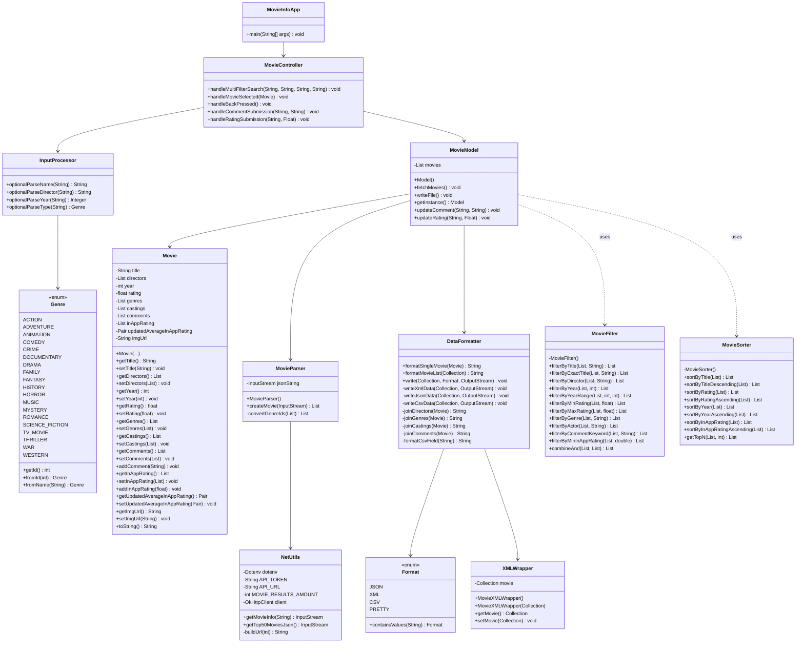

# Java Src

Main java source files - you do not have to have them in the 'student' package, but you will
still want to consider other packages as it helps your project layout.

```mermaid
classDiagram

class MovieInfoApp {
    +main(String[] args) void
}


class MovieModel {
    -List<Movie> movies
    +Model()
    +fetchMovies() void
    +writeFile() void
    +getInstance() Model
    +updateComment(String, String) void
    +updateRating(String, Float) void
}


class MovieController {
    +handleMultiFilterSearch(String, String, String, String) void
    +handleMovieSelected(Movie) void
    +handleBackPressed() void
    +handleCommentSubmission(String, String) void
    +handleRatingSubmission(String, Float) void
}

class MovieParser {
    -InputStream jsonString
    +MovieParser()
    +createMovie(InputStream) List<Movie>
    -convertGenreIds(List<Integer>) List<Genre>
}

class NetUtils {
    +getMovieInfo(String) InputStream
    +getTop50MoviesJson() InputStream
    -buildUrl(int) String
    -Dotenv dotenv
    -String API_TOKEN
    -String API_URL
    -int MOVIE_RESULTS_AMOUNT
    -OkHttpClient client
}

class Movie {
    -String title
    -List<String> directors
    -int year
    -float rating
    -List<Genre> genres
    -List<String> castings
    -List<String> comments
    -List<Float> inAppRating
    -Pair<Float, Integer> updatedAverageInAppRating
    -String imgUrl
    +Movie(...)
    +getTitle() String
    +setTitle(String) void
    +getDirectors() List<String>
    +setDirectors(List<String>) void
    +getYear() int
    +setYear(int) void
    +getRating() float
    +setRating(float) void
    +getGenres() List<Genre>
    +setGenres(List<Genre>) void
    +getCastings() List<String>
    +setCastings(List<String>) void
    +getComments() List<String>
    +setComments(List<String>) void
    +addComment(String) void
    +getInAppRating() List<Float>
    +setInAppRating(List<Float>) void
    +addInAppRating(float) void
    +getUpdatedAverageInAppRating() Pair<Float, Integer>
    +setUpdatedAverageInAppRating(Pair<Float, Integer>) void
    +getImgUrl() String
    +setImgUrl(String) void
    +toString() String
}

class Genre {
    <<enum>>
    ACTION
    ADVENTURE
    ANIMATION
    COMEDY
    CRIME
    DOCUMENTARY
    DRAMA
    FAMILY
    FANTASY
    HISTORY
    HORROR
    MUSIC
    MYSTERY
    ROMANCE
    SCIENCE_FICTION
    TV_MOVIE
    THRILLER
    WAR
    WESTERN
    +getId() int
    +fromId(int) Genre
    +fromName(String) Genre
}


class DataFormatter {
    +formatSingleMovie(Movie) String
    +formatMovieList(Collection<Movie>) String
    +write(Collection<Movie>, Format, OutputStream) void
    -writeXmlData(Collection<Movie>, OutputStream) void
    -writeJsonData(Collection<Movie>, OutputStream) void
    -writeCsvData(Collection<Movie>, OutputStream) void
    -joinDirectors(Movie) String
    -joinGenres(Movie) String
    -joinCastings(Movie) String
    -joinComments(Movie) String
    -formatCsvField(String) String
}

class Format {
    <<enum>>
    JSON
    XML
    CSV
    PRETTY
    +containsValues(String) Format
}

class XMLWrapper {
    -Collection<Movie> movie
    +MovieXMLWrapper()
    +MovieXMLWrapper(Collection<Movie>)
    +getMovie() Collection<Movie>
    +setMovie(Collection<Movie>) void
}

class InputProcessor {
    +optionalParseName(String) String
    +optionalParseDirector(String) String
    +optionalParseYear(String) Integer
    +optionalParseType(String) Genre
}

class MovieFilter {
    -MovieFilter()
    +filterByTitle(List<Movie>, String) List<Movie> 
    +filterByExactTitle(List<Movie>, String) List<Movie> 
    +filterByDirector(List<Movie>, String) List<Movie> 
    +filterByYear(List<Movie>, int) List<Movie>
    +filterByYearRange(List<Movie>, int, int) List<Movie> 
    +filterByMinRating(List<Movie>, float) List<Movie> 
    +filterByMaxRating(List<Movie>, float) List<Movie> 
    +filterByGenre(List<Movie>, String) List<Movie> 
    +filterByActor(List<Movie>, String) List<Movie> 
    +filterByCommentKeyword(List<Movie>, String) List<Movie> 
    +filterByMinInAppRating(List<Movie>, double) List<Movie> 
    +combineAnd(List<Movie>, List<Movie>) List<Movie> 
}

class MovieSorter {
    -MovieSorter()
    +sortByTitle(List<Movie>) List<Movie> 
    +sortByTitleDescending(List<Movie>) List<Movie> 
    +sortByRating(List<Movie>) List<Movie> 
    +sortByRatingAscending(List<Movie>) List<Movie> 
    +sortByYear(List<Movie>) List<Movie> 
    +sortByYearAscending(List<Movie>) List<Movie>
    +sortByInAppRating(List<Movie>) List<Movie>
    +sortByInAppRatingAscending(List<Movie>) List<Movie> 
    +getTopN(List<Movie>, int) List<Movie> 
}

%% Relationships
MovieInfoApp --> MovieController


MovieController --> InputProcessor
MovieController --> MovieModel

InputProcessor --> Genre

MovieModel --> Movie
MovieModel --> MovieParser
MovieModel --> DataFormatter

MovieParser --> NetUtils

DataFormatter --> Format
DataFormatter --> XMLWrapper

MovieModel ..> MovieFilter : uses
MovieModel ..> MovieSorter : uses
```

